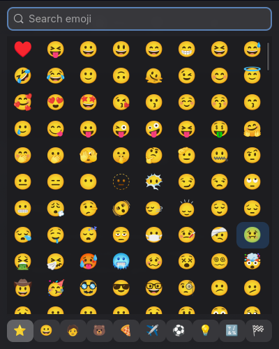

# smirk 😏

An emoji picker for Wayland that opens in ~10 ms.



Written in Rust with GTK4. It runs as a hidden resident process; pressing your
keybinding activates it over D-Bus, so the window appears at once instead of
paying a cold start. The grid is a virtualized `GtkGridView`, so only the
visible cells exist as widgets, and emoji render through Pango, which handles
skin tones, flags, and ZWJ sequences (🤦🏽‍♀️) correctly.

Named after [Smile](https://github.com/mijorus/smile), the picker it replaced:
same idea, smaller, faster.

## Features

- Ranked search over CLDR names and shortcodes; Enter picks the best match
- Type anywhere: keystrokes land in the search box
- Click or Enter copies, hides the window, and pastes into the app you were in
  (`wl-copy` + `wtype` Ctrl+V)
- Right-click an emoji for its skin-tone variants
- Recents, sorted by how often you use them, shown first
- Category filter bar
- Escape or closing the window hides it; the process stays resident

## Install

Requires GTK4, libadwaita, `wl-clipboard`, and `wtype`.

```sh
cargo build --release
```

### Run as a resident service (recommended)

```sh
cp contrib/smirk.service ~/.config/systemd/user/
systemctl --user enable --now smirk.service
cp contrib/smirk-toggle ~/.local/bin/
```

`contrib/smirk-toggle` activates the running instance over D-Bus and falls
back to a cold start if the service is down. Bind it to a key.

### Hyprland

```conf
bindd = SUPER, period, Emoji picker, exec, ~/.local/bin/smirk-toggle

# float at cursor position
windowrule = float on, match:class ^lt.yiin.smirk$
windowrule = size 400 500, match:class ^lt.yiin.smirk$
windowrule = move max(0\,min(cursor_x-200\,monitor_w-400)) max(0\,min(cursor_y-250\,monitor_h-500)), match:class ^lt.yiin.smirk$
```

The window class is `lt.yiin.smirk`; adapt the rules for other compositors.

## Why it's fast

Cold-starting a GTK app costs toolkit init plus building the widget tree; for
a naive emoji grid that's thousands of widgets. smirk avoids both: the process
starts once (systemd user service, `Restart=always`), the keybinding only
sends a D-Bus `Activate`, and the virtualized grid realizes ~90 cells no
matter how many emoji exist. Measured on the machine it was built for: warm
open ~11 ms, cold start to mapped window ~850 ms, 92 MB resident.

## License

MIT
